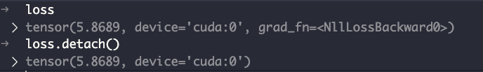
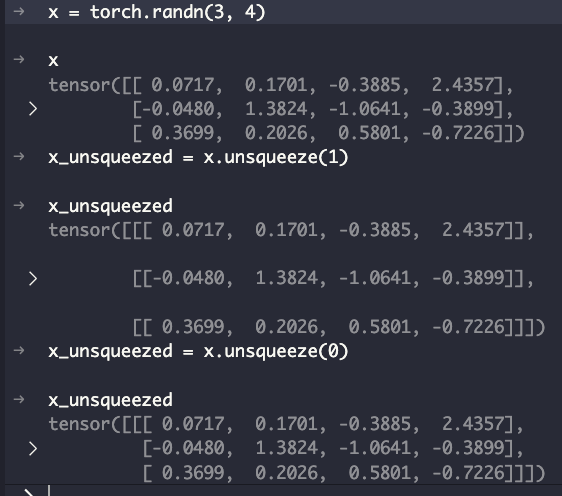

# torch
{: .fs-9 }

[Document](https://pytorch.org/docs/stable/index.html).
{: .fs-6 .fw-300 }

## Table of contents
{: .no_toc .text-delta }

1. TOC
{:toc}

---
## torch.nn.Module
```python
class QAModel(torch.nn.Module):
    def __init__(self, config):
        super(QAModel, self).__init__()
        self.model = get_hf_model(config).eval()
        self.tokenizer = get_tokenizer(config)
        self.device = config["device"]

    def forward(self, batch):
        logits = []
        self.loss = []
        for item in batch["text"]:
            item = {f"{k1}" : v1.to(self.device) for k1, v1 in item.items()}
            output = self.model(**item)
            logits.append(output.logits)
            try:
                self.loss.append(output.loss)
            except:
                pass
        self.loss = torch.stack(self.loss).mean()
        return torch.stack(logits)

    def get_loss(self, logits, batch):
        return self.loss
```
*  defines a new class named QAModel that inherits from torch.nn.Module

### super
```python
 super(QAModel, self).__init__()
```
* This line calls the constructor of the parent class, `torch.nn.Module`, with the arguments `QAModel` and `self`. These arguments are passed to super() to specify the class (QAModel) and the instance (self) from which the superclass methods are being called.
* However, in Python 3, it's more common to see super() called without arguments inside a class method, which implicitly passes the current class and instance. 


### model.modules()
```python
for m in model.modules():
            if isinstance(m, nn.Dropout):
                m.p = config.dropout
                n_reset += 1
```
* This line iterates over all modules in the model and checks if the module is an instance of `nn.Dropout`.
* The modules in a PyTorch model can be accessed using the `model.modules()` method, which returns an iterator over all modules in the model, including submodules.
* If the module is an instance of `nn.Dropout`, the dropout probability `m.p` is set to the value specified in the `config` object, and the counter `n_reset` is incremented.

### Definition of modules in pytorch
[Explain.](https://stackoverflow.com/questions/51804692/what-exactly-is-the-definition-of-a-module-in-pytorch)

* Base class for all neural network modules. Your models should also subclass this class. Modules can also contain other Modules, allowing to nest them in a tree structure. You can assign the submodules as regular attributes. Submodules assigned in this way will be registered, and will have their parameters converted too when you call .cuda(), etc.
* All network components should inherit from nn.Module and override the forward() method. That is about it, as far as the boilerplate is concerned. Inheriting from nn.Module provides functionality to your component. For example, it makes it keep track of its trainable parameters, you can swap it between CPU and GPU with the .to(device) method, where device can be a CPU device torch.device("cpu") or CUDA device torch.device("cuda:0").

### model.eval()
[Explain.](https://stackoverflow.com/questions/60018578/what-does-model-eval-do-in-pytorch)

* model.eval() is a kind of switch for some specific layers/parts of the model that behave differently during training and inference (evaluating) time. For example, Dropouts Layers, BatchNorm Layers etc. You need to turn them off during model evaluation, and .eval() will do it for you. In addition, the common practice for evaluating/validation is using torch.no_grad() in pair with model.eval() to turn off gradients computation:

* Sets model in evaluation (inference) mode:

  • normalisation layers use running statistics
  • de-activates Dropout layers

.jpg){:"width"=70%}


### batch of data
```python
import numpy as np
import torch
import torch.utils.data as data_utils

# Create toy data
x = np.linspace(start=1, stop=10, num=10)
x = np.array([np.random.normal(size=len(x)) for i in range(100)])
print(x.shape)
# >> (100,10)

# Create DataLoader
input_as_tensor = torch.from_numpy(x).float()
dataset = data_utils.TensorDataset(input_as_tensor)
dataloader = data_utils.DataLoader(dataset,
                                   batch_size=100,
                                  )
batch = next(iter(dataloader))

print(type(batch))
# >> <class 'list'>

print(len(batch))
# >> 1

print(type(batch[0]))
# >> class 'torch.Tensor'>
```
* batch is a list containing a single element, which is a torch.Tensor. This is because the DataLoader is configured to return a single batch of data with a batch size of 100. The batch contains 100 samples, each with 10 features. The shape of the tensor is (100, 10), corresponding to the batch size and feature dimensions.
```python
for item in batch["text"]:
            item = {f"{k1}" : v1.to(self.device) for k1, v1 in item.items()}
            output = self.model(**item)
            logits.append(output.logits)
            try:
                self.loss.append(output.loss)
            except:
                pass
```
* In PyTorch, a batch is often represented as a tensor or a list/dictionary of tensors, depending on the complexity of the data and the model's requirements. The line `for item in batch["text"]:` suggests that, in this context, `batch` is expected to be a dictionary where one of the keys is `"text"`, and the value associated with this key is an iterable collection of items (likely tensors) that represent the input data to be processed.

### Batch Normalization
[Explain.](https://machinelearningmastery.com/batch-normalization-for-training-of-deep-neural-networks/)

### Layer normalization

### calling forward function
```python
output = self.model(**item)
```
* In PyTorch, when you call a model instance directly with arguments, it internally calls the model's forward method, passing those arguments. 

### logits
```python
output = self.model(**item)
logits.append(output.logits)
```
* `.logits`: This attribute of the output object contains the logits. For a classification model, each logit corresponds to the score of each class before applying the softmax function. For example, in a model trained to classify images into three categories, the logits might be a tensor like [2.0, -1.0, 0.5], indicating the raw scores for each of the three classes.

### torch.stack
```python
# Python 3 program to demonstrate torch.stack() method 
# for two one dimensional tensors 
# importing torch 
import torch 

# creating tensors 
x = torch.tensor([1.,3.,6.,10.]) 
y = torch.tensor([2.,7.,9.,13.]) 

# printing above created tensors 
print("Tensor x:", x) 
print("Tensor y:", y) 

# join above tensor using "torch.stack()" 
print("join tensors:") 
t = torch.stack((x,y)) 

# print final tensor after join 
print(t) 

print("join tensors dimension 0:") 
t = torch.stack((x,y), dim = 0) 
print(t) 

print("join tensors dimension 1:") 
t = torch.stack((x,y), dim = 1) 
print(t) 
```
```cmd
Tensor x: tensor([ 1.,  3.,  6., 10.])
Tensor y: tensor([ 2.,  7.,  9., 13.])
join tensors:
tensor([[ 1.,  3.,  6., 10.],
        [ 2.,  7.,  9., 13.]])
join tensors dimension 0:
tensor([[ 1.,  3.,  6., 10.],
        [ 2.,  7.,  9., 13.]])
join tensors dimension 1:
tensor([[ 1.,  2.],
        [ 3.,  7.],
        [ 6.,  9.],
        [10., 13.]])
```

### torch.utils.data.Dataset
.jpg){:"width"=70%}

[Code.](https://pytorch.org/docs/stable/_modules/torch/utils/data/dataset.html#Dataset)

### torch.utils.data.DataLoader
[Code.](https://pytorch.org/docs/stable/data.html#torch.utils.data.DataLoader)

* Data loader combines a dataset and a sampler, and provides an iterable over the given dataset.

The DataLoader supports both map-style and iterable-style datasets with single- or multi-process loading, customizing loading order and optional automatic batching (collation) and memory pinning.
```python
edit_loader = DataLoader(edits, batch_size=1, shuffle=True)
```
* This line creates a DataLoader object named `edit_loader` that loads data from the `edits` dataset with a batch size of 1 and shuffles the data before each epoch. The DataLoader is used to iterate over the dataset in batches during training or evaluation.
* `dataset` (Dataset) – dataset from which to load the data.
* `batch_size` (int, optional) – how many samples per batch to load (default: 1).
  * number of samples we want to pass into the training loop at each iteration
* `shuffle` (bool, optional) – set to True to have the data reshuffled at every epoch (default: False).
* `batch_size=1` means that each batch will contain a single sample from the dataset. This is useful when you want to process each sample individually, such as in the case of sequence-to-sequence models or models that require different input sizes for each sample.
  
### batch_size and GPU memory's relation
* Large Batch Sizes: A large batch size improves GPU utilisation by allowing more parallelism. GPUs are designed to handle massive amounts of data simultaneously, and larger batch sizes enable better exploitation of their computational power.
[Explain.](https://www.linkedin.com/pulse/optimising-gpu-utilisation-finding-ideal-batch-size-maximum-bose#:~:text=The%20Relationship%20Between%20Batch%20Size%20and%20GPU%20Utilisation&text=Large%20Batch%20Sizes%3A%20A%20large,exploitation%20of%20their%20computational%20power.)

### Difference btw DataLoader and Dataset
[Explain.](https://mmengine.readthedocs.io/en/latest/tutorials/dataset.html)
* Typically, a dataset defines the quantity, parsing, and pre-processing of the data, while a dataloader iteratively loads data according to settings such as batch_size, shuffle, num_workers, etc. 
* Datasets are encapsulated with dataloaders and they together constitute the data source.


### pad_token_id
* This specific attribute of the tokenizer represents the ID (a numerical value) used to denote padding tokens in the tokenized input.
  

### padding tokens
* Padding tokens are used to ensure that all sequences in a batch have the same length. This is necessary when working with neural networks that require fixed-size inputs, such as recurrent neural networks (RNNs) or transformers. By padding sequences to a common length, you can efficiently process multiple sequences in parallel without having to handle sequences of varying lengths separately.
* model.tokenizer.pad_token_id is used to retrieve the ID of the padding token from the tokenizer associated with a pre-trained model.
  * Padding tokens are used to fill sequences to a uniform length during batch processing.


### named_parameters
* named_parameters(prefix='', recurse=True, remove_duplicate=True)
* Returns an iterator over module parameters, yielding both the name of the parameter as well as the parameter itself.
  

### requires_grad=False
* If you want to freeze part of your model and train the rest, you can set requires_grad of the parameters you want to freeze to False.
  ```python
  for n, p in self.model.named_parameters():
            p.requires_grad = False
    ```

## Indexing
* PyTorch modules support indexing to access their submodules if they are stored in an ordered container like torch.nn.Sequential, torch.nn.ModuleList, or a custom module that implements the __getitem__ method to allow such access. 

### __getitem__

#### Map-style datasets
A map-style dataset is one that implements the `__getitem__()` and `__len__()` protocols, and represents a map from (possibly non-integral) indices/keys to data samples.

For example, such a dataset, when accessed with **dataset[idx]**, could read the idx-th image and its corresponding label from a folder on the disk.

See Dataset for more details.

#### Iterable-style datasets
An iterable-style dataset is an instance of a subclass of IterableDataset that implements the `__iter__()` protocol, and represents an iterable over data samples. This type of datasets is particularly suitable for cases where random reads are expensive or even improbable, and where the batch size depends on the fetched data.

For example, such a dataset, when called iter(dataset), could return a stream of data reading from a database, a remote server, or even logs generated in real time.

See IterableDataset for more details.

### DenseReluDense
* This is a specific type of layer or component within the Transformer model. The name suggests it is a feed-forward neural network consisting of two dense (fully connected) layers with a ReLU activation function in between. This pattern is common in Transformer models, where it's used to process the data after the self-attention mechanism within each block. It's also known as a position-wise feed-forward network (FFN).

### torch.no_grad()
[Explain.](https://pytorch.org/docs/stable/generated/torch.no_grad.html)
[Explain.](https://datascience.stackexchange.com/questions/32651/what-is-the-use-of-torch-no-grad-in-pytorch)


### TORCH.NANMEAN
* Computes the mean of all non-NaN elements along the specified dimensions.
[Explain.](https://pytorch.org/docs/stable/generated/torch.nanmean.html)

### torch.nn.parameter.Parameter
[Explain](https://pytorch.org/docs/stable/generated/torch.nn.parameter.Parameter.html)
* data (Tensor) – parameter tensor.
* requires_grad (bool, optional) – if the parameter requires gradient.
  * Note that the torch.no_grad() context does NOT affect the default behavior of Parameter creation–the Parameter will still have requires_grad=True in no_grad mode. 

### What does the tensor’s “H”,”T” attributes mean?
* [T explain](https://pytorch.org/docs/stable/tensors.html#torch.Tensor.T)
* Returns a view of this tensor with its dimensions reversed.
* If n is the number of dimensions in x, x.T is equivalent to x.permute(n-1, n-2, ..., 0).

* [H explain](https://pytorch.org/docs/stable/tensors.html#torch.Tensor.H)
* Returns a view of a matrix (2-D tensor) conjugated and transposed.
* x.H is equivalent to x.transpose(0, 1).conj() for complex matrices and x.transpose(0, 1) for real matrices.

```python
import torch
print(T)
print(T.H)
print(T.T)
```
```cmd
tensor([[  363,  1075,   405,  7272,    63,  1347, 17328,   577,    16,  3370,   58,     1]]) # T

tensor([[  363],
        [ 1075],
        [  405],
        [ 7272],
        [   63],
        [ 1347],
        [17328],
        [  577],
        [   16],
        [ 3370],
        [   58],
        [    1]])   # T.H

tensor([[  363],
        [ 1075],
        [  405],
        [ 7272],
        [   63],
        [ 1347],
        [17328],
        [  577],
        [   16],
        [ 3370],
        [   58],
        [    1]])   # T.T
```


### TORCH.ISNAN
[Explain.](https://pytorch.org/docs/stable/generated/torch.isnan.html)
Returns a new tensor with boolean elements representing if each element of input is NaN or not. Complex values are considered NaN when either their real and/or imaginary part is NaN.
```bash
torch.isnan(torch.tensor([1, float('nan'), 2]))
#tensor([False, True, False])
```
```python
TRR = TRR[~torch.isnan(TRR)]##TRR[~torch.isnan(TRR)] applies this mask to the TRR tensor, selecting only the elements where the mask is True, i.e., filtering out all NaN values from TRR.
```

### .detach()
```python
key = query.detach()
```
* .detach(): This method is called on the query tensor. 
* The detach() method creates a new tensor that does not require gradients, effectively detaching the resulting tensor from the computation graph. 
* In PyTorch, tensors that require gradients keep track of operations performed on them to allow for gradient computation during backpropagation. 
 
 

### .view(1)
```python
epsilon = torch.tensor(self.init_epsilon, device=self.device, requires_grad=False).view(1)
```
* .view(1): This method reshapes the tensor to have a single element. 
* It's equivalent to reshaping the tensor to have the shape (1,), making it explicitly a 1-dimensional tensor with one element. 
* This can be useful for ensuring compatibility with other tensors or operations that expect inputs of specific dimensions.

#### .view(-1, len(query))
```python
 dists = torch.cdist(self.keys, query, p=2).view(-1, len(query))
```
* After computing the distances, the .view() method is used to reshape the resulting tensor. The -1 argument tells PyTorch to infer the size of this dimension based on the other dimensions, ensuring the total number of elements remains the same. len(query) sets the size of the second dimension explicitly to the number of vectors in query. This reshaping is typically done to ensure the tensor has a specific shape for subsequent operations or for easier interpretation of the results.
{:"width"=70%}
{:"width"=70%}


### torch.cdist
* This function computes the pairwise distances between two sets of vectors. 
* The first set of vectors is self.keys, and the second set is query. 
* The parameter p=2 specifies that the distance metric to be used is the Euclidean distance (also known as the L2 norm). 
* The result of torch.cdist is a 2D tensor where each element (i, j) represents the distance between the i-th vector in self.keys and the j-th vector in query.

### .min(0)
* .min(0): The min function is called on the dists tensor with the argument 0, which specifies the dimension along which to find the minimum values. 
* In this case, 0 refers to the first dimension (often corresponding to rows in a 2D tensor). 
* This operation will find the minimum value in each column of the dists tensor, effectively identifying the smallest distance for each query point to the reference points in self.keys.
{:"width"=70%}

# Tensor
* 在深度学习里，Tensor实际上就是一个多维数组（multidimensional array）。
* 而Tensor的目的是能够创造更高维度的矩阵、向量。
  {:"width"=70%}
  {:"width"=70%}
  {:"width"=70%}

### len(tensor)
* len(tensor) returns the length of the **first dimension** of the tensor.

### torch.vstack
```python
values = torch.nn.Parameter(torch.vstack([self.values, new_value]), requires_grad=True) # Add new value to list of values
```
* The torch.vstack() function is used to vertically stack the new_value tensor onto the self.values tensor. 
* This operation effectively adds new_value as a new row to the self.values tensor, assuming new_value is a 2D tensor with a single row or a 1D tensor. 
* The result is a new tensor that combines the original set of values with the new value.

### torch.where
```python
import torch

# Condition tensor
condition = torch.tensor([True, False, True, False])

# Tensors from which to choose values
x = torch.tensor([1, 2, 3, 4])
y = torch.tensor([10, 20, 30, 40])

# Use torch.where to select elements
result = torch.where(condition, x, y)

print(result)  # Output: tensor([ 1, 20,  3, 40])
```
* In this example, elements from x are selected where condition is True, and elements from y are selected where condition is False.
#### condition 的维度和x y什么关系
##### 相同维度
* 当 condition、x 和 y 具有完全相同的维度时，torch.where 会逐元素地检查 condition，并从 x 或 y 中选择相应的元素。例如，如果所有输入都是形状为 (2, 2) 的张量，那么 torch.where 会分别检查这些张量中的每个元素。
##### 广播
* PyTorch 支持自动广播（broadcasting），这意味着在某些情况下，即使 condition、x 和 y 的维度不完全相同，torch.where 也可以正常工作。广播规则允许较小的张量在某些维度上“扩展”以匹配较大张量的形状，但这需要遵循特定的规则：
  * 如果 condition、x 和 y 中的一个或多个张量在某个维度上的大小为 1 而其他张量在该维度上的大小大于 1，则大小为 1 的张量会在该维度上扩展以匹配最大的大小。
  * 如果 condition、x 和 y 中的一个张量在某个维度上不存在（即，它的维度数少于其他张量），则该张量会在缺失的维度上“扩展”以匹配其他张量的形状。

### repeat_interleave
```python
torch.repeat_interleave(input, repeats, dim=None)
```
* input: The input tensor whose elements you want to repeat.
* repeats: The number of repetitions for each element. This can be a scalar or a tensor specifying the number of repetitions for each element.
* dim: The dimension along which to repeat values. If None, the input tensor is flattened before repeating, and the output will also be flat.


### unsqueeze(1)
* 在张量的指定位置插入一个维度，其大小为1。当你调用unsqueeze(1)时，它会在第二个维度的位置（索引从0开始计算）插入一个新的维度。

* unsqueeze方法不会改变张量中的数据，只是改变了张量的形状。
* 如果你需要在张量的最前面或最后面添加一个新维度，可以使用unsqueeze(0)或unsqueeze(-1)。
```python
x = torch.randn(3, 4)
x.unsqueeze(1).shape
torch.Size([3, 1, 4])
x.unsqueeze(0).shape
torch.Size([1, 3, 4])
```

### self.model.parameters()
* a method call that returns an iterator over the parameters of the model, where self.model is an instance of a neural network model. 
* These parameters typically include all the learnable weights and biases of the model. 
* The method is commonly used when setting up an optimizer, which requires knowledge of the parameters it will be updating during the training process.

### torch.optim.Adam
```python
optimizer = torch.optim.Adam(params, lr=0.001, betas=(0.9, 0.999), eps=1e-08, weight_decay=0, amsgrad=False)
```
*  `params` (iterable): Iterable of parameters to optimize or dictionaries defining parameter groups.


### outputs.loss
```python
type(outputs)
###<class 'transformers.modeling_outputs.Seq2SeqLMOutput'>
loss = outputs.loss
```
* the outputs returned by the model includes a loss attribute. This means the loss calculation is likely integrated within the model's forward pass or immediately after it, within the same operation that produces outputs
* The actual calculation of the loss depends on the model's implementation and the task at hand.
  * For many tasks, especially classification, a common choice is Cross-Entropy Loss.
  * If the task is regression, Mean Squared Error (MSE) might be used instead.
* The specific loss function used (CrossEntropyLoss, MSELoss, etc.) requires the model's predictions and the true labels (targets) as inputs. 
  * The true labels are part of tokens or otherwise provided to the model. 
  * The loss function then compares the predictions against the true labels to compute the loss value, which quantifies how well the model's predictions match the true labels.
  
### optimizer.step()
```python
if i == 0:
                # --- we only need to create an optimizer for the first iteration (but forward pass instantiates the key, so optimzer is passed after first inference) ---
                optimizer = torch.optim.Adam(self.model.parameters(), config["editor"]["edit_lr"])
loss = outputs.loss
            print(f"loss of iteration {i}: {loss}")
            loss.backward()
            optimizer.step()
```
* This method applies the computed gradients to update the model's parameters. 
* The specific way the parameters are updated depends on the optimization algorithm being used. 
* For example, in the case of SGD, the update rule might look something like param = param - learning_rate * param.grad, where param is a parameter of the model, learning_rate is a hyperparameter that controls the size of the update step, and param.grad is the gradient of the loss function with respect to param.

### optimizer.zero_grad()
```python
optimizer.zero_grad()
```
* This line clears (resets to zero) the gradients of all model parameters. 
* Gradients in PyTorch accumulate by default, meaning that every time .backward() is called, the gradients of the loss with respect to the parameters are added to the existing gradients instead of replacing them. 
* This feature is useful in certain contexts, like when training RNNs, but in most training loops, you want to prevent the accumulation from previous iterations.

#### Why Clear Gradients?

* Before computing the gradients for the current step, you need to ensure that the gradients from the previous step do not interfere. 
* Failing to clear gradients would result in accumulating gradients across batches or iterations, which is typically not what you want for standard gradient descent optimization processes. 
* This accumulation would lead to incorrect gradient values and, consequently, incorrect updates to the model's parameters, hindering the training process.
* 这是为了确保每一次迭代的梯度计算都是基于最新的迭代而不是之前迭代的累积结果。

#### loss.detach()
* In PyTorch, when you perform operations on tensors that require gradients (i.e., tensors with requires_grad=True), PyTorch builds a computation graph that tracks the operations and the tensors involved. This graph is used during the backward pass to compute gradients with respect to some scalar value, typically a loss in the context of training neural networks.

### self.trainig()
* This line sets the model to training mode.