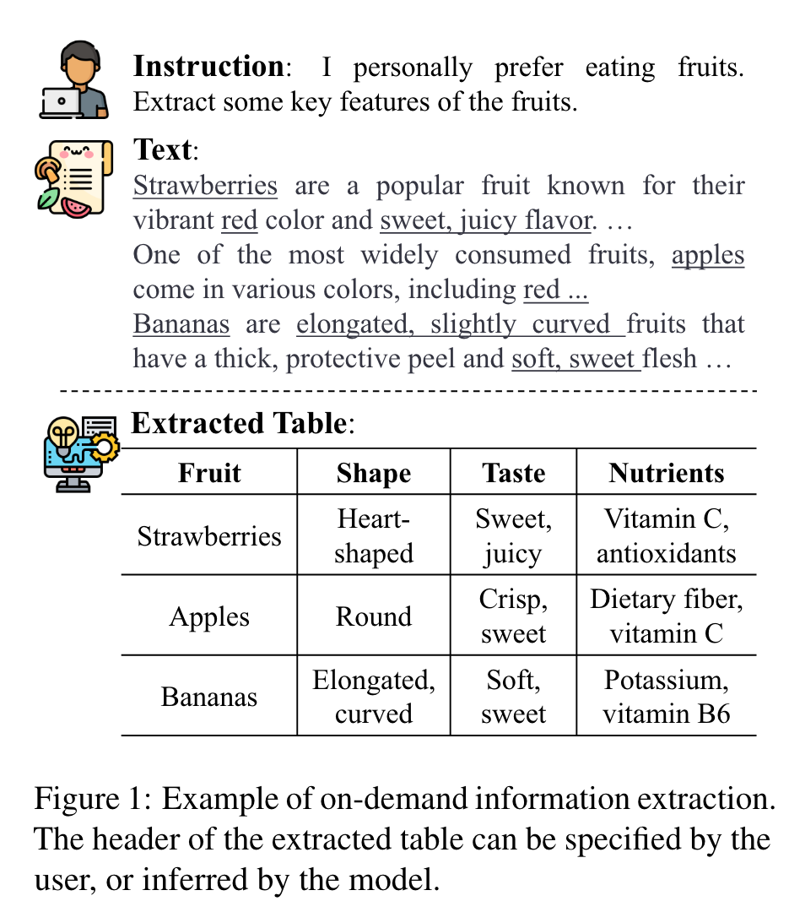
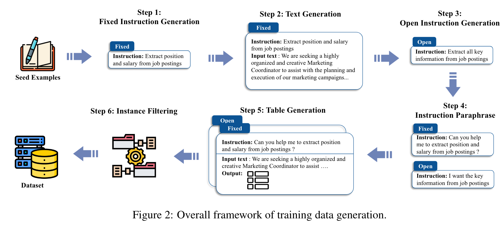

# Instruct and Extract: Instruction Tuning for On-Demand Information Extraction
{: .fs-9 }

[Code.](https://github.com/yzjiao/On-Demand-IE)
{: .fs-6 .fw-300 }

{:width="500"}

## Task Formulation
* given a user instruction I and associated background text X, the model M is designed to extract pertinent information and organize it into a structured table T
* In the table, the first row represents the table header and the rest is the extracted content.
* To better align with real user needs, note that the input instructions are not required to explicitly specify the header to be extracted.
* With this criterion, instructions are categorized into two types
  * fixed instruction
    * the desired headers for the output table are clearly defined
    * the model’s task is to pull out the relevant content from the text
  * open instruction
    * first infer table headers based on the context
    * then extract corresponding information.

## Automatic Generation of Training Data
{:width="1000"}