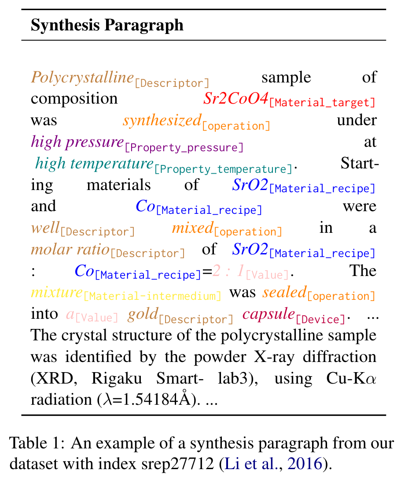
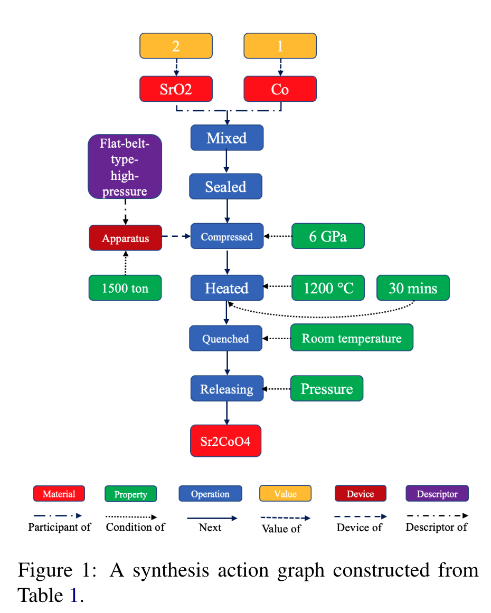
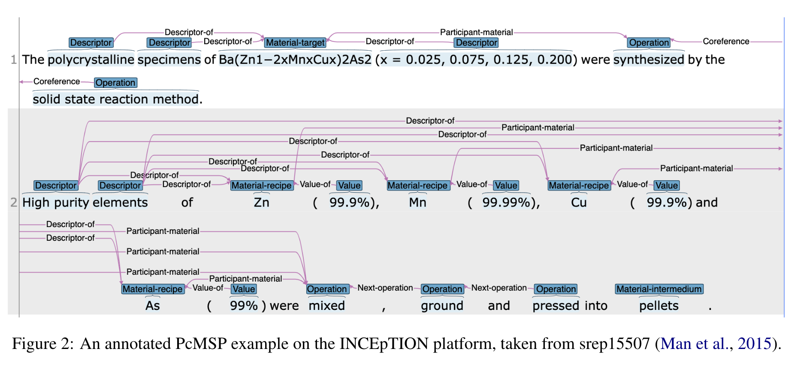

# PcMSP: A Dataset for Scientific Action Graphs Extraction from Polycrystalline Materials Synthesis Procedure Text
{: .fs-9 }

[Code.](https://github.com/Xianjun-Yang/PcMSP)
{: .fs-6 .fw-300 }

{:width="400"}
{:width="600"}
{:width="800"}
## Methods
* The core idea uses one encoding layer (e.g. Long Short-Term Memory (LSTM) (Hochreiter and Schmidhuber, 1997), BERT) for representation and one additional conditional random fields (CRF (Lafferty et al., 2001)) layer for sequence labeling.
* Then relations are predicted based on either gold entities or predicted entities, and PURE (Zhong and Chen, 2021) designs two separate encoders for joint extraction of entities and relations.
  * We adopt their model for our tasks due to its super performance.

### Why do we discard characterization sentences?
* Inorganic reactions typically involve relatively few reactions from a set of precursors and there are very few purification pathways for solid materials compared to organic materials or liquids.
* Therefore, characterizations of solid-state inorganic reactions are seldom reported in literature unless they proceed to complete purity within standard measurement fidelity.

### Why do we annotate sentence, entity, and relation simultaneously?
* A full action graph consists of both entities and relations extracted from experimental-describing sentences.
* However, most previous research either ignores the annotation of sentence or relation information, making them incomplete for action graph construction. To fill this gap, we aim to annotate all pertinent information jointly.