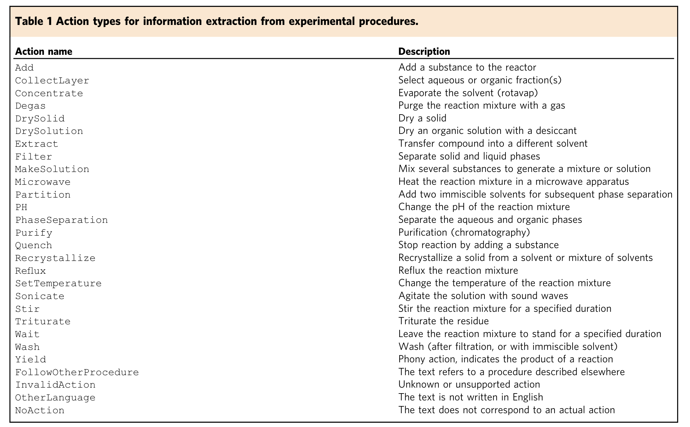

# Automated extraction of chemical synthesis actions from experimental procedures
{: .fs-9 }

[Code.](https://github.com/ccsnow127/paragraph2actions)
{: .fs-6 .fw-300 }

## Methods
* We formulate the extraction of action sequences from experimental procedures as a sequence-to-sequence translation, in which experimental procedures are translated to the textual representation of the actions defined in Table 1.
{:width="1000"}